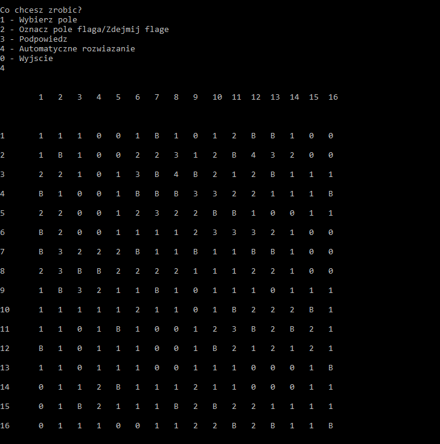

# Opis programu
Gra “Saper” w wersji konsolowej.
Zaimplementowane funkcjonalności:
- możliwość wybrania poziomu trudności (różna wielkość planszy, ilość bomb oraz ilość podpowiedzi).
- zapisywanie wyników do pliku.
# Screenshot

